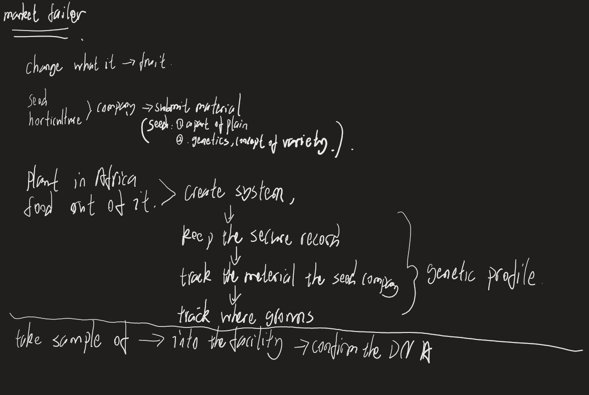
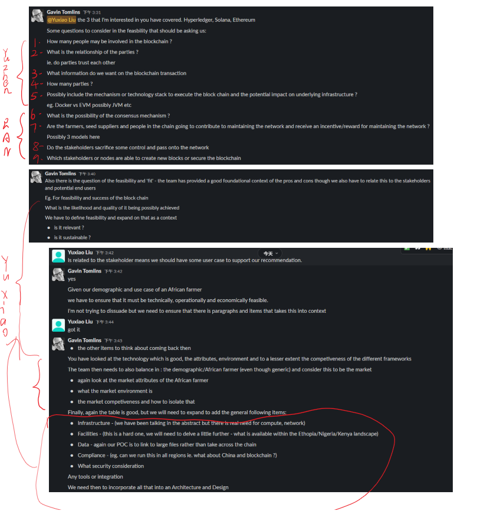

# Echological Sounds Meeting Records

## Membership
| Name              |      UID |                               
|:------------------|---------:|
| Gefei Shan        | u6839726 |    
| Yuxiao Liu        | u7371990 |                
| Ran Zhang         | u6760490 |         
| Yuzhen Qi         | u7394366 |      

### Tips: This markdown file is to record contacting with client, task assignment and decision making in our team.
***  
 

## Team Meeting 1 - Week 1 - 8.1 15:00 - 8.1 16:00 (start-end time)
**Absent:** None
 
**Record in the meeting:** 
1. Introduce the project.
2. How the project relate to the organization like Africa farm.

## Team Meeting 2 - Week 4 - 8.15 16:00 - 8.15 16:40 (start-end time)
**Absent:** None
 
**Record in the meeting:** 

## Team Meeting 3 - Week 4 - 8.16 14:00 - 8.16 15:00 (start-end time)
**Absent:** None
 
**Record in the meeting:** 

**Task After Meeting:** 
1. Think about Andzrej examples and the use of the words 'seed', 'profile', 'phenotypic', 'smart contract' and how they apply to the conversation
2. Understand the progression from Web 1.0, Web 2.0, to Web 3.0
3. Understand - Decentralisation, Immutable, Smart Contract, Ledger, DLT as a start

## Team Meeting 4 - Week 5 - 8.22 15:00 - 8.22 16:00 (start-end time)
**Absent:** None
 
**Record in the meeting:** 
1. Discuss the previous topic about ledger, DLT, Decentralized and so on.
2. Discuss how the profile should be implemented in the blockchain.
3. Client introduce how seed gene profile relate to smart contract. 

**Task After Meeting:** 
1. Each person continuing find an open source blockchain platform and try to find difference between each other. Make a sheet to compare. Before Wednesday.
2. Next week should have a coding task about to implement an open-source blockchain demo.

       

## Team Meeting 5 - Week 6 - 8.29 15:30 - 8.22 16:00 (start-end time)
**Record in the meeting:**
That`s meeting is like a chat and dicuss and all the record was in slack.

**Task After Meeting:** 
Please see the detailed task in onenote.

To be short:
- Research business models for our blockchains models, about What we can offer our stakeholders and what they may offer.
- Research technical possibilities, like model security considerations, model capacity, efficiences, workload for future development.
- Make a plan about future works during the teaching break.

## Team Meeting 6 - Week 8 - 9.26 15:00 - 16:00 (start-end time)
**Record in the meeting:**  
1. SOW - GT is wanting this to be a hybrid of his document (on Google drive - please review) and what @yuzhenqin has been working on. If I can get a copy of the existing SOW from your side I'm happy to start merging them. Please send via Slack.  
2. Smart Contract attribute list - we'll want this properly documented. Lei will create and upload a template to Drive for collaboration. Requires team suggestions for phrases in sequence to be included.  
3. Feedback on development environment - need general thoughts, machine specs and feedback for budget consideration so DArT can set up cloud nodes (AWS/Linode)

**Decision Making:**
Team leader infer some of the task that should do and each team member pick on of the task.

**Task:**
Ran: Find hyperledger fabric data structure and profile.
Gefei: Try to build our own profile and data structure based on hyperledger fabric.
Yuxiao: Working on the record, assigning work and reflection.
Yuzhen: Rough system structure for the whole blockchain system.

## Team Meeting 7 - Week 8 9.29 On Slack
**Record for the communication:**  
1. AWS Requirement: For AWS environment. For test and develop environment, I think the requirement is 2 EC2 machines with 2 core cpu and 4 G ram; ubuntu 20.04 or later and 30 G / (root) drive  

## Team Meeting 8 - Week 8 9.30 On Slack
**Record for the communication:**  
Yuxiao Liu: Actually our group has the concerned about AWS machine because our team want to establish the environment and start developing as soon as possible.  
Gavin: @Yuxiao Liu
can you elaborate your concern a bit more ? From our meeting the other day, an action item was for the team to provide a specification on the machine so the DArT team could follow up and make a decision. Have the team go the specs ?  
Yuxiao: Yep, we have provided a specification on the machine to Lei. For our concerning is just because we have to finish a showcase video and preparing for audit3. I thought we need to have enough time to working on a develop version system.  

## Team Meeting 9 - Week 8 10.2 On Tencent Meeting
**Record for the communication:**   
1. Determine the division of labour for each individual. 
2. Have a discussion about smart contract attribute. 

**Assignment:**   
Yuxiao: Development environment build.
Gefei: Smart contract organized.
Ran: Smart contract developed through golang.
Yuzhen: Follow the SoW.

## Team Meeting 10 - Week 9 10.4 On Tencent Meeting
**Record for the communication:**   
1. Job progress update after finishing the environment build.
2. Finally determine the whole contents for smart contract demo. 
3. Negotiate Amazon Cloud configuration and submit to client.
4. Start the plan for showcase video.

**Result of meeting:**   
Continuing working on smart contract development. 

## Team Meeting 11 - Week 9 10.6 On Tencent Meeting
**Record for the communication:**   
The whole meeting is about finishing the detail of showcase video.

## Team Meeting 12 - Week 10 10.13 On Tencent Meeting
**Record for the communication:**   
Before Audit3 Team Meeting  
1. Assign each part for team members.  
2. Working together to achieve all of the content in Audit3.