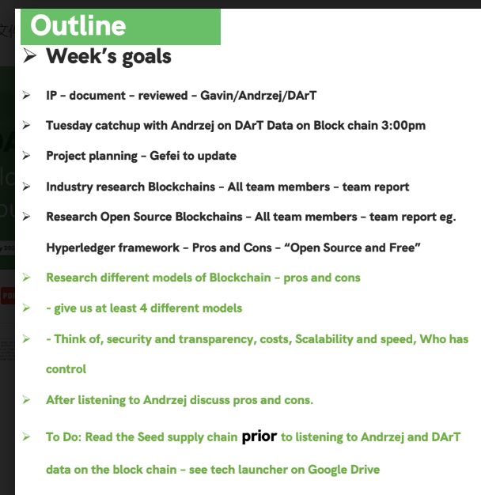
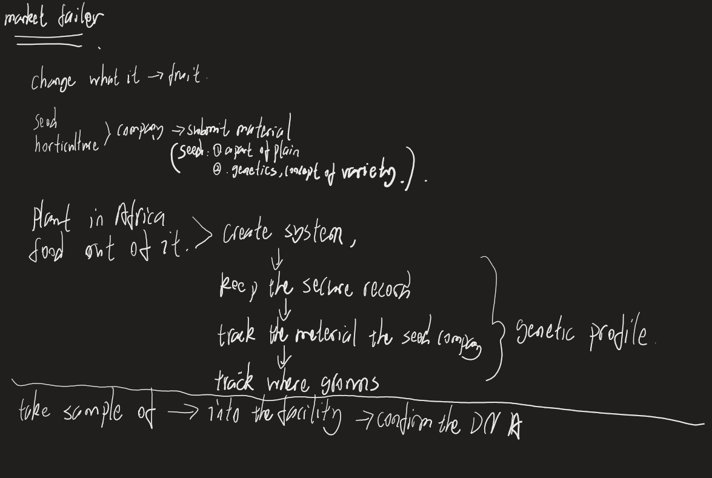
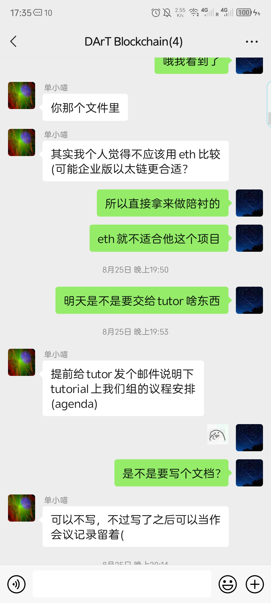
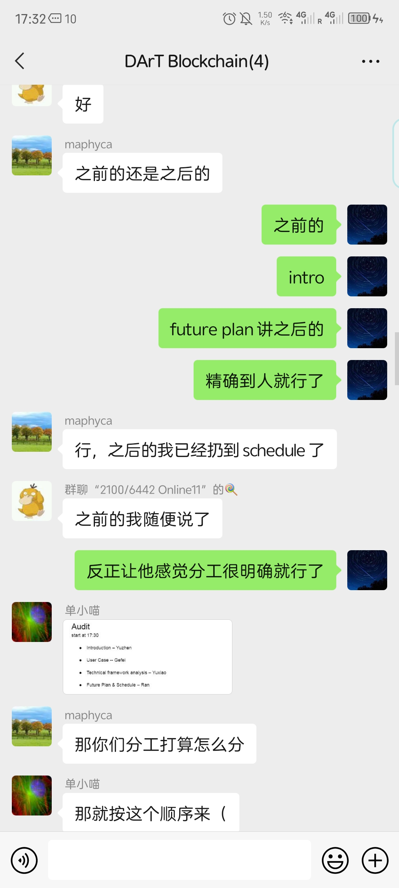
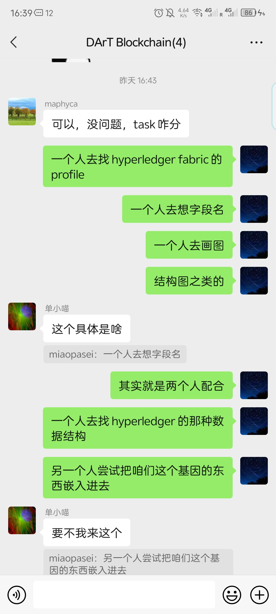

# Echological Sounds

## Team Meeting 1 - Week 1 - 8.1 15:00 - 8.1 16:00 (start-end time)
**Absent:** None
 
**Record in the meeting:** 
1. Introduce the project.
2. How the project relate to the organization like Africa farm.

## Team Meeting 2 - Week 4 - 8.15 16:00 - 8.15 16:40 (start-end time)
**Absent:** None
 
**Record in the meeting:** 

## Team Meeting 3 - Week 4 - 8.16 14:00 - 8.16 15:00 (start-end time)
**Absent:** None
 
**Record in the meeting:** 

**Task After Meeting:** 
1. Think about Andzrej examples and the use of the words 'seed', 'profile', 'phenotypic', 'smart contract' and how they apply to the conversation
2. Understand the progression from Web 1.0, Web 2.0, to Web 3.0
3. Understand - Decentralisation, Immutable, Smart Contract, Ledger, DLT as a start

## Team Meeting 4 - Week 5 - 8.22 15:00 - 8.22 16:00 (start-end time)
**Absent:** None
 
**Record in the meeting:** 
1. Discuss the previous topic about ledger, DLT, Decentralized and so on.
2. Discuss how the profile should be implemented in the blockchain.
3. Client introduce how seed gene profile relate to smart contract. 

**Task After Meeting:** 
1. Each person continuing find an open source blockchain platform and try to find difference between each other. Make a sheet to compare. Before Wednesday.
2. Next week should have a coding task about to implement an open-source blockchain demo.

## Membership
| Name              |      UID |                               
|:------------------|---------:|
| Gefei Shan        | u6839726 |    
| Yuxiao Liu        | u7371990 |                
| Ran Zhang         | u6760490 |         
| Yuzhen Qi         | u7394366 |             

## Team Meeting 5 - Week 6 - 8.29 15:30 - 8.22 16:00 (start-end time)
**Record in the meeting:**
That`s meeting is like a chat and dicuss and all the record was in slack.

**Task After Meeting:** 
Please see the detailed task in onenote.

To be short:
- Research business models for our blockchains models, about What we can offer our stakeholders and what they may offer.
- Research technical possibilities, like model security considerations, model capacity, efficiences, workload for future development.
- Make a plan about future works during the teaching break.

# Part of Team chating Through Wechat 

## Team Chating - Week 5
**Record:**

## Team Chating - Week 6
**Record:**

## Team Chating - Week 7
**Record:**

**Task:**
Ran: Find hyperledger fabric data structure and profile.
Gefei: Try to build our own profile and data structure based on hyperledger fabric.
Yuxiao: Working on the record, assigning work and reflection.
Yuzhen: Rough system structure for the whole blockchain system.

