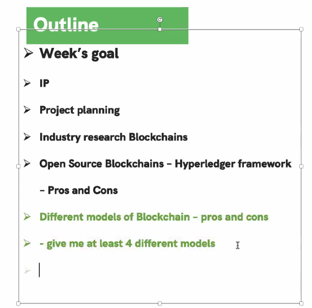

# Group Group Group

## Team Meeting 1 - Week 1 - 8.1 15:00 - 8.1 16:00 (start-end time)
**Absent:** None
 
**Lead/scribe:** Introduce the project.

## Team Meeting 2 - Week 4 - 8.15 16:00 - 8.15 16:40 (start-end time)
**Absent:** None
 
**Record in the meeting:** 

**Lead/scribe:** Wait for fill

## Team Meeting 3 - Week 4 - 8.16 14:00 - 8.16 15:00 (start-end time)
**Absent:** None
 
**Record in the meeting:** 

**Task After Meeting:** 
1. Think about Andzrej examples and the use of the words 'seed', 'profile', 'phenotypic', 'smart contract' and how they apply to the conversation
2. Understand the progression from Web 1.0, Web 2.0, to Web 3.0
3. Understand - Decentralisation, Immutable, Smart Contract, Ledger, DLT as a start

## Membership
| Name              |      UID |                               
|:------------------|---------:|
| Gefei Shan        | u6839726 |    
| Yuxiao Liu        | u7371990 |                
| Ran Zhang         | u6760490 |         
| Yuzhen Qi         | u7394366 |             
